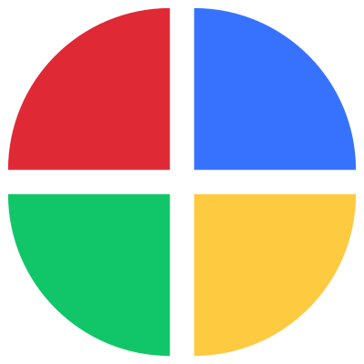
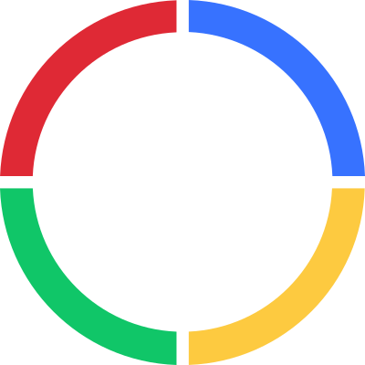

# Color Switch (Clon)

Proyecto que contiene la mecánica básica del videojuego Color Switch disponible para móviles y pc, donde ayudas a un circulo que cambia de color a pasar por diferentes obstáculos haciendo coincidir el color del circulo con el color de los obstáculos. En el caso de que el color no coincida, el circulo se destruye y el jugador pierde la partida.

    
    
Logo del videojuego Color Switch Original

Para este desarrollo se utiliza el motor de videojuegos **Unity** (versión 6000.0.28f1 LTS) y el lenguaje predefinido en dicho motor **C#**.

## Arte y Apariencia
Si bien el juego está copiando la mecánica principal del videojuego original, se ha querido utilizar colores diferentes. En este caso parecido a los colores primarios:

### Sprites
A continuación se presentan los sprites utilizados para crear los obstáculos que el jugador tiene que sobrepasar junto con un power-up o, en este caso, un sprite que hace de switch y obliga a cambiar de color aleatoriamente al personaje.

#### Sprite Power-Up/Switch
Este es un sprite (figura 1) que le da la habilidad al jugador de cambiar, de forma aleatoria, su color al tocarlo. Lo que obliga al jugador a moverse a través de los obstáculos de su mismo color para seguir avanzando.

    
    
Figura 1 - Sprite Power-Up/Switch

#### Sprite Obstáculos
Hay dos sprites que se utilizan para crear los obstáculos principales que el jugador debe traspasar. El primero (figura 2) es un circulo dividido en cuatro partes, cada parte tiene un color por donde el jugador, dependiendo de su propio color, puede traspasar o no. El segundo (figura 3) es un sprite que contiene una forma básica con la que se puede crear diferentes obstáculos como una cruz, barreras que se mueven horizontalmente, etc.

    

    
    
Figura: 2 - Obstáculo circular de colores

    

    

    
    
Figura 3 - Barra de colores

    

> [!NOTE]
> Este proyecto está desarrollado con el objetivo de aprender y/o repasar conceptos básicos del motor gráfico Unity.