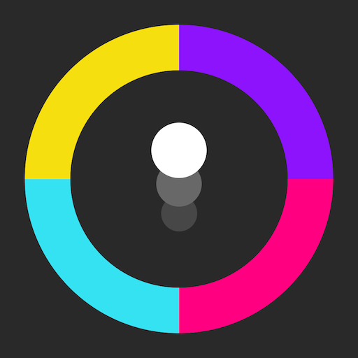

# Color Switch (Clon)

Proyecto que contiene la mecánica básica del videojuego Color Switch desponible para móviles y pc, donde ayudas a un circulo que cambia de color a pasar por diferentes obstaculos haciendo coincidir el color del circulo con el color de los obstaculos. En el caso de que el color no coincida, el circulo se destruye y el jugador pierde la partida.

    
    <figcaption>Logo del videojuego Color Switch Original</figcaption>
     

Para este desarrollo se utiliza el motor de videojuegos **Unity** (versión 6000.0.28f1 LTS) y el lenguaje predefinido en dicho motor **C#**.

> [!NOTE]
> Este proyecto está desarrollado con el objetivo de aprender y/o repasar conceptos básicos del motor gráfico Unity.